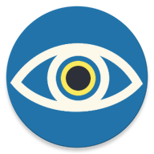

# OptigAI

    

Autorzy:
- [Jakub Jakacki](https://github.com/JakubJakacki18)
- [Klaudia Natalia Klim](https://github.com/Hackeristi)

## Opis projektu
**OptigAI** to projekt aplikacji wspomagającej osoby niedowidzące oraz niewidome dedykowanej
na urządzenia z systemem Android.  

Główne funkcjonalności aplikacji to:
- Rozpoznawanie tekstu
- Rozpoznawanie pisma Braille'a
- Rozpoznawanie obiektów
- Możliwość wykonania zdjęcia kamerą aplikacji
- Analiza zdjęcia udostępnienionego poprzez inną aplikację
- Wybór zdjęcia z wbudowanej galerii w aplikację
- Zbliżenie oraz lampa błyskowa w kamerze aplikacji
- Edycja zdjęcia przed analizą
- Integracja z czytnikiem ekranu TalkBack
- Możliwość dostosowania aplikacji pod względem widoczności

## Język aplikacji
- **Polski**
- **Angielski**

## Interfejs użytkownika

Interfejs użytkownika aplikacji został zaprojektowany z myślą o prostocie i intuicyjności, aby
umożliwić łatwe korzystanie z aplikacji przez osoby z różnymi stopniami niepełnosprawności 
wzrokowej. Kolorystyka aplikacji dobrana jest tak, aby osoby z daltonizmem mogły swobodnie z niej 
korzystać. Przyciski oraz czcionki są odpowiednio duże usprawniając czytelność. Dzięki integracji z
czytnikiem ekranu TalkBack, użytkownicy mogą łatwo nawigować po aplikacji oraz korzystać z jej 
funkcji. 

## Urządzenia docelowe
Telefony z systemem Android API 29-36 (Android 10 Quince Tart - Android 16 Baklava). Urządzenie do wykonania zdjęcia potrzebuje tylnej kamery. Dostęp do internetu jest wymagany podczas analizy pisma Braille'a.

## Analiza

Na ekranie wyboru analizy możemy odpowiednią opcję analizy zdjęcia. Kliknięcie przenosi nas do ekranu wyniku na którym znajdują się **DetectionOverlay** (kolorowe ramki wskazujące na miejsce wykrycia, podczas analizy przedmiotów nazwa wykrytego element z dokładnością wyświetlona jest nad ramką) oraz tekstowy opis pod zdjęciem. Po najechaniu palcem na ramkę z włączonym TalkBackiem odczytywany jest element pod palcem.

### Tekst
Tekst jest rozpoznawany poprzez bibliotekę [ML Kit Text Recognition](https://developers.google.com/ml-kit/vision/text-recognition/v2). Biblioteka wyszukuje oraz wypisuje bloki tekstu.

### Braille

### Przedmioty codziennego użytku

Aplikacja rozpoznaje 81 klas obiektów:
  
  1. Klucze
  1. Człowiek
  1. Rower
  1. Samochód
  1. Motocykl
  1. Samolot
  1. Autobus
  1. Pociąg
  1. Ciężarówka
  1. Łódź
  1. Sygnalizacja świetlna
  1. Hydrant
  1. Znak stop
  1. Parkometr
  1. Ławka
  1. Ptak
  1. Kot
  1. Pies
  1. Koń
  1. Owca
  1. Krowa
  1. Słoń
  1. Niedźwiedź
  1. Zebra
  1. Żyrafa
  1. Plecak
  1. Parasol
  1. Torebka
  1. Krawat
  1. Walizka
  1. Frisbee
  1. Narty
  1. Snowboard
  1. Piłka do gry
  1. Latawiec
  1. Kij baseballowy
  1. Rękawica baseballowa
  1. Deskorolka
  1. Deska surfingowa
  1. Rakieta tenisowa
  1. Butelka
  1. Kieliszek do wina
  1. Kubek
  1. Widelec
  1. Nóż
  1. Łyżka
  1. Miska
  1. Banan
  1. Jabłko
  1. Kanapka
  1. Pomarańcza
  1. Brokuł
  1. Marchewka
  1. Hot dog
  1. Pizza
  1. Pączek
  1. Ciasto
  1. Krzesło
  1. Kanapa
  1. Roślina doniczkowa
  1. Łóżko
  1. Stół jadalny
  1. Toaleta
  1. Telewizor
  1. Laptop
  1. Mysz komputerowa
  1. Pilot
  1. Klawiatura
  1. Telefon komórkowy
  1. Mikrofalówka
  1. Piekarnik
  1. Toster
  1. Zlew
  1. Lodówka
  1. Książka
  1. Zegar
  1. Wazon
  1. Nożyczki
  1. Miś pluszowy
  1. Suszarka do włosów
  1. Szczoteczka do zębów

  Jest to zrealizowane poprzez **autorsko wytrenowany model** do rozpoznawania kluczy na podstawie modelu **Yolo11m** oraz model **Yolo11m** trenowany na COCO firmy [Ultralystics](https://www.ultralytics.com/). Zbiór danych jest mieszaniną autorskich zdjęć oraz pochodzących z [Roboflow](https://universe.roboflow.com/main-m4puh/keys-wd8b7/dataset/1). Wszystkie zdjęcia były ponownie etykietowane ze starannością za pomocą [Label Studio](https://labelstud.io/). Łącznie po selekcji danych wraz z nowymi zdjęciami model był trenowany 789 obrazach.  

## Wykorzystane technologie / biblioteki
Projekt został zrealizowany w języku **Kotlin**. Do uczenia modelu wykorzystany był **Python**/**Google Colab**. Etykietowanie zostało zrealizowane poprzez [Label Studio](https://labelstud.io/).

Użyte biblioteki wraz z ich przeznaczeniem: 
| Biblioteka | Przeznaczenie |
| :------------ |:-------------:|
|  CameraX| Obsługa podglądu z kamery oraz wykonywania zdjęć |
| ML Kit Text Recognition | Rozpoznawanie tekstu drukowanego na podstawie obrazu z aparatu |
| Retrofit/OkHttp | Wysyłanie obrazu do zewnętrznego API odpowiedzialnego za rozpoznawanie pisma Braille’a |
|TensorFlow Lite|Obsługa modeli sztucznej inteligencji|
|Glide|Efektywne ładowanie i wyświetlanie obrazów w interfejsie|
|UCrop|Przycinanie i kadrowanie zdjęć przed ich dalszym przetwarzaniem|
|Protobuf|Serializacja oraz deserializacja danych w formacie Protocol Buffers|
|Kotlin Courutines|Obsługa operacji asynchronicznych i przetwarzania równoległego|
|Datastore|Przechowywanie ustawień|

## Znane problemy

Na dzień dzisiejszy aplikacja zmaga się z kilkoma problemami wynikającymi z uproszczonego podejścia podczas projektowania.
Jeżeli projekt będzie rozwijany prawdopodbnie zostaną one rozwiązane lub zminimalizowane. Na większość z nich mamy w głowie pomysły na ich rozwiązanie.

### Nakładanie się wykrycia
Przez fakt iż modele są uruchamiane równolegle jest duża szansa na nałożenie się wyników błędnie rozpoznanych kluczy najczęściej jako nóż lub nożyczki na poprawnie wykryte klucze poprzez model dedykowany detekcji kluczom.

### Rozpoznawanie Braille'a
Aby pismo Braille'a było poprawnie rozpoznane zdjęcie poddane analizie musi zawierać pismo ustawione idealnie w poziomie. W innym przypadku wynik będzie niepoprawny.

