# OptigAI

    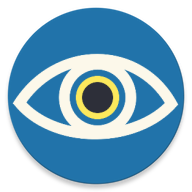

Autorzy:

- [Jakub Jakacki](https://github.com/JakubJakacki18)
- [Klaudia Natalia Klim](https://github.com/Hackeristi)

## Opis projektu

**OptigAI** to projekt aplikacji wspomagającej osoby niedowidzące oraz niewidome dedykowanej
na urządzenia z systemem Android.

Główne funkcjonalności aplikacji to:

- Rozpoznawanie tekstu
- Rozpoznawanie pisma Braille'a
- Rozpoznawanie obiektów
- Możliwość wykonania zdjęcia kamerą aplikacji
- Analiza zdjęcia udostępnienionego poprzez inną aplikację
- Wybór zdjęcia z wbudowanej galerii w aplikację
- Zbliżenie oraz lampa błyskowa w kamerze aplikacji
- Edycja zdjęcia przed analizą
- Integracja z czytnikiem ekranu TalkBack
- Możliwość dostosowania aplikacji pod względem widoczności

## Język aplikacji

- **Polski**
- **Angielski**

## Interfejs użytkownika

Interfejs użytkownika aplikacji został zaprojektowany z myślą o prostocie i intuicyjności, aby
umożliwić łatwe korzystanie z aplikacji przez osoby z różnymi stopniami niepełnosprawności
wzrokowej. Kolorystyka aplikacji dobrana jest tak, aby osoby z daltonizmem mogły swobodnie z niej
korzystać. Przyciski oraz czcionki są odpowiednio duże usprawniając czytelność. Dzięki integracji z
czytnikiem ekranu **TalkBack**, użytkownicy mogą łatwo nawigować po aplikacji oraz korzystać z jej
funkcji.

### Kamera - ekran główny aplikacji

Ekran kamery to centralny punkt aplikacji, umożliwiający błyskawiczne przejście do galerii oraz ustawień. Z tego poziomu można wykonać zdjęcie, korzystając z lampy błyskowej oraz funkcji przybliżenia (zoom). Przybliżać obraz możesz za pomocą intuicyjnego gestu uszczypnięcia lub suwaka.

    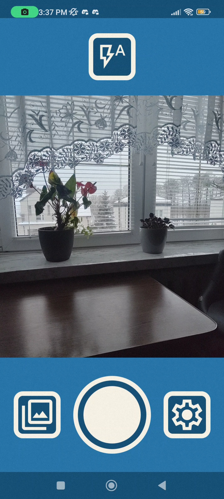
    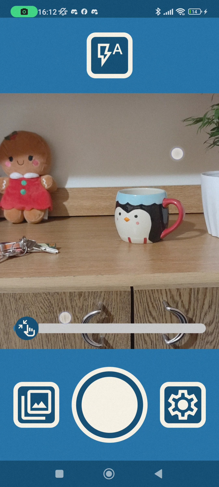

### Galeria

Galeria wyświetla zdjęcia wykonane przez aplikację. Po kliknięciu na zdjęcie wchodzimy do podglądu zdjęcia, a tam możemy wybrać zdjęcie do analizy.

    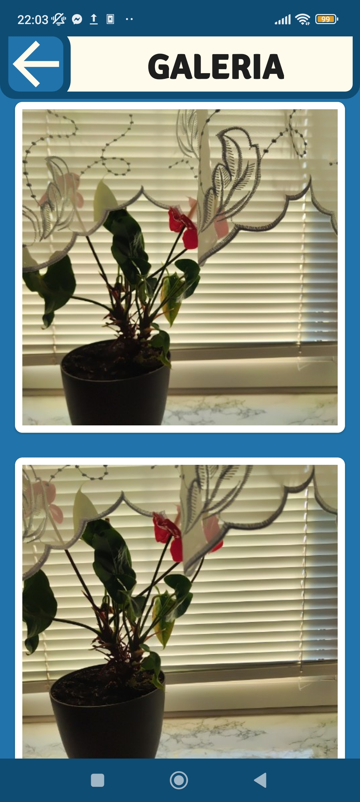
    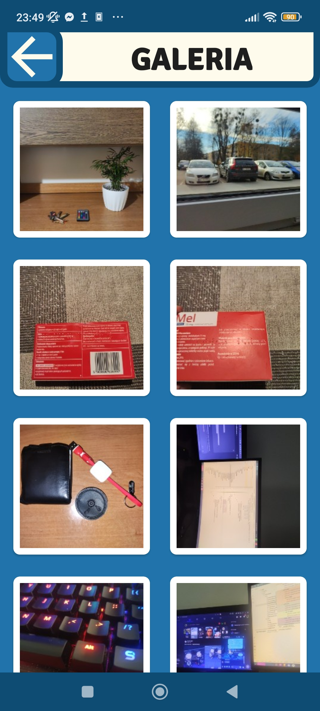

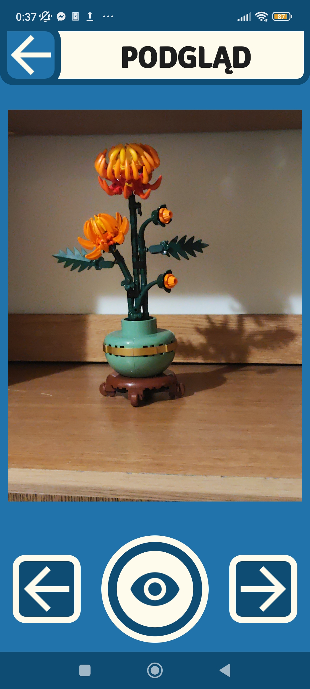

### Ustawienia

W ustawieniach można dostosować aplikację według wymagań użytkownika. Takimi opcjami są:

- Włączenie lub wyłączenie zapisu zdjęcia do pamięci urządzenia,
- Ustawienie widoczności suwaka przybliżenia (opcja automatyczna wyświetla suwak podczas wykonywania gestu),
- Ustawienie ilości kolumn w galerii od 1 do 3,
- Ustawienie wielkości czcionki na ekranie wyniku analizy od 16 do 48sp,
- Ustawienie wyświetlanych kolorów adnotacji,

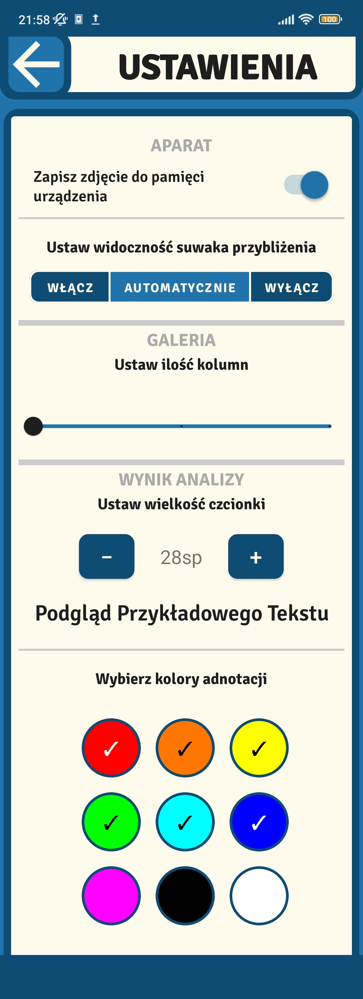

### Ekran wyboru analizy

    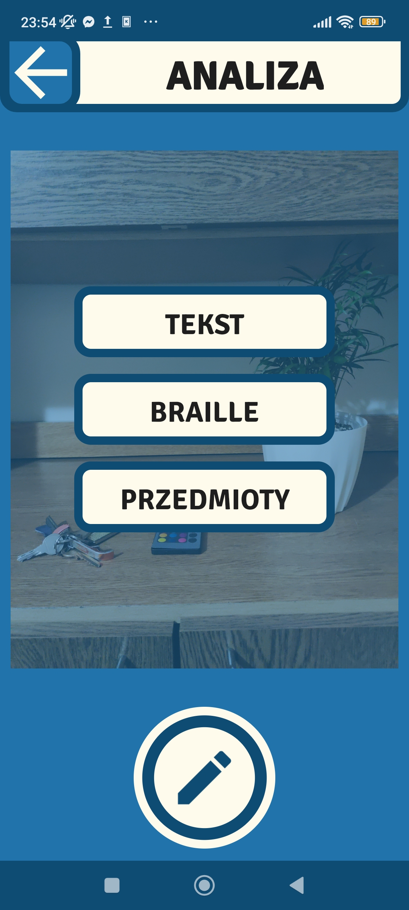
    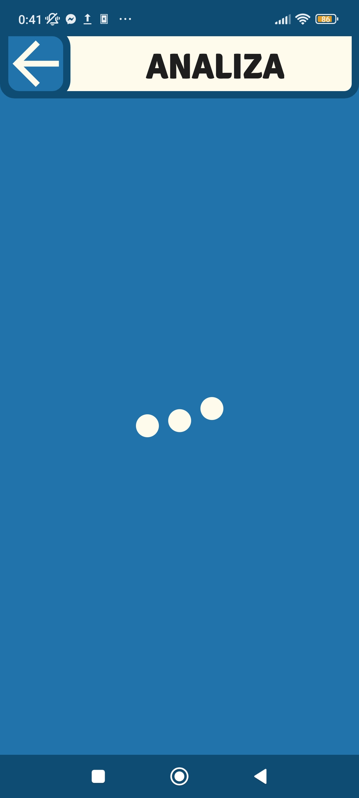

### Ekran wyniku analizy

#### Analiza tekstu

    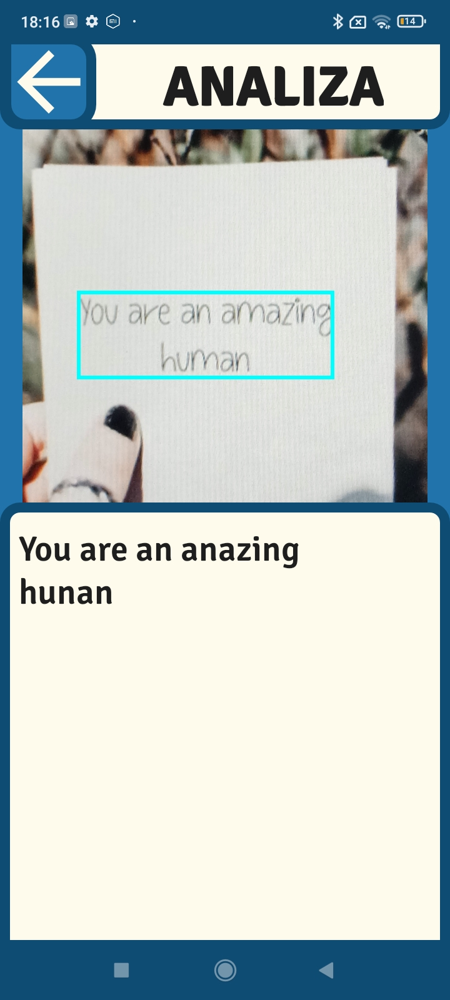
    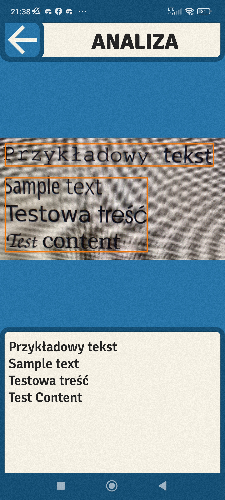

#### Analiza Braille'a

    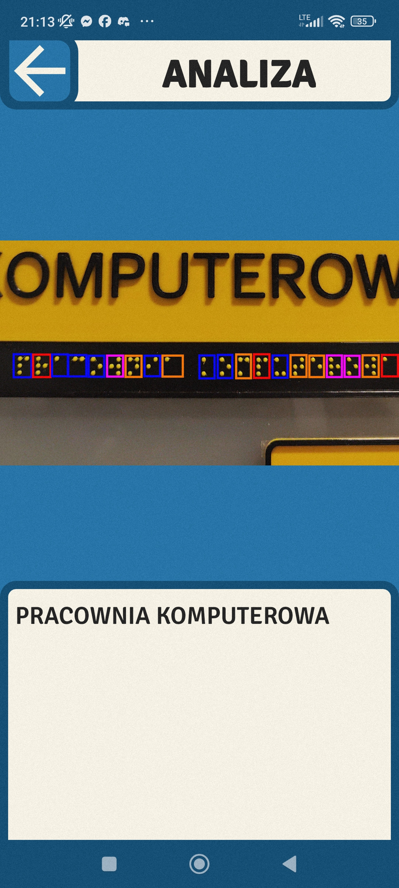
    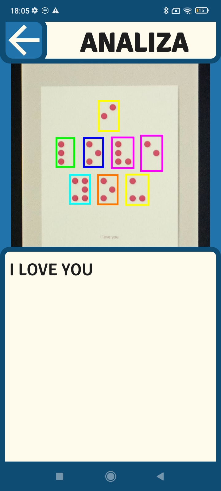

#### Analiza przedmiotów

    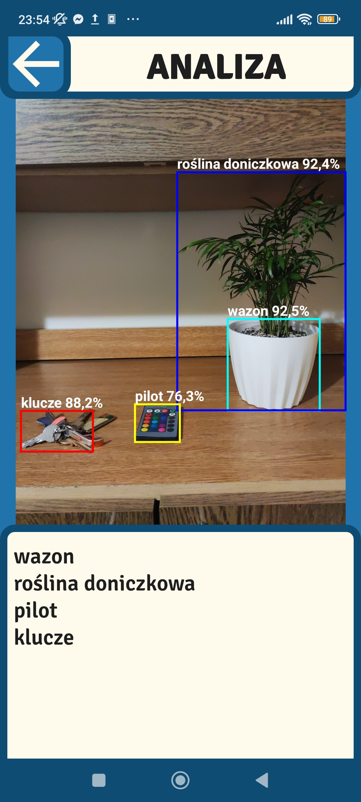
    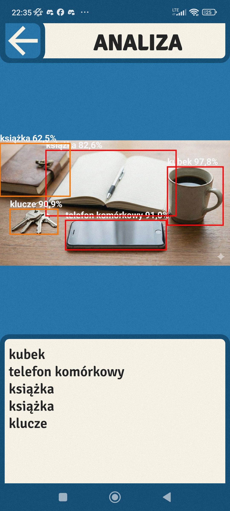

### Edycja obrazu

Edycja obrazu została zrealizowana za pośrednictwem zmodyfikowanej pod kątem stylistycznym oraz tłumaczeniowym biblioteki [uCrop](https://github.com/Yalantis/uCrop).

Odnośnik do zmodyfikowanej biblioteki: [uCrop-fork](https://github.com/JakubJakacki18/uCrop)

    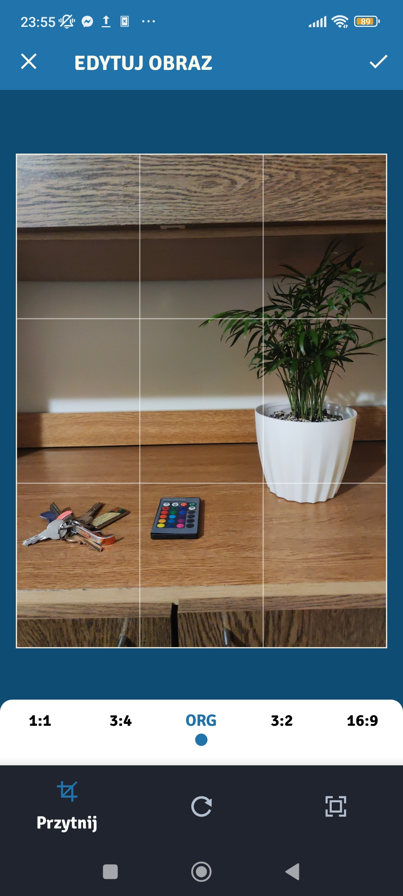
    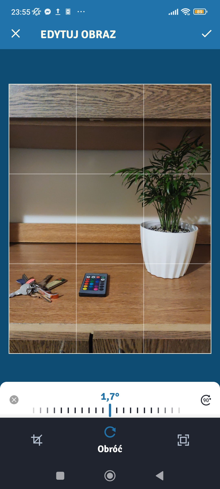
    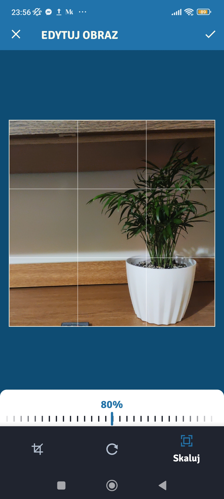

## Urządzenia docelowe

Telefony z systemem Android API 29-36 (Android 10 Quince Tart - Android 16 Baklava). Urządzenie do wykonania zdjęcia potrzebuje tylnej kamery. Dostęp do internetu jest wymagany podczas analizy pisma Braille'a.

## Analiza

Na ekranie wyboru analizy możemy wybrać odpowiednią opcję analizy zdjęcia. Kliknięcie przenosi nas do ekranu wyniku na którym znajdują się **DetectionOverlay** (kolorowe ramki wskazujące na miejsce wykrycia, podczas analizy przedmiotów nazwa wykrytego elementu z dokładnością wyświetlona jest nad ramką) oraz tekstowy opis pod zdjęciem. Po najechaniu palcem na ramkę z włączonym **TalkBackiem** odczytywany jest element pod palcem.

### Tekst

Tekst jest rozpoznawany poprzez bibliotekę [ML Kit Text Recognition](https://developers.google.com/ml-kit/vision/text-recognition/v2). Biblioteka wyszukuje oraz wypisuje bloki tekstu.

### Braille

Pismo braille'a jest rozpoznawane za pomocą zewnętrznego modelu **Yolo** udostępnionego poprzez **API Roboflow**.

### Przedmioty codziennego użytku

Aplikacja rozpoznaje 81 klas obiektów:

1. Klucze
2. Człowiek
3. Rower
4. Samochód
5. Motocykl
6. Samolot
7. Autobus
8. Pociąg
9. Ciężarówka
10. Łódź
11. Sygnalizacja świetlna
12. Hydrant
13. Znak stop
14. Parkometr
15. Ławka
16. Ptak
17. Kot
18. Pies
19. Koń
20. Owca
21. Krowa
22. Słoń
23. Niedźwiedź
24. Zebra
25. Żyrafa
26. Plecak
27. Parasol
28. Torebka
29. Krawat
30. Walizka
31. Frisbee
32. Narty
33. Snowboard
34. Piłka do gry
35. Latawiec
36. Kij baseballowy
37. Rękawica baseballowa
38. Deskorolka
39. Deska surfingowa
40. Rakieta tenisowa
41. Butelka
42. Kieliszek do wina
43. Kubek
44. Widelec
45. Nóż
46. Łyżka
47. Miska
48. Banan
49. Jabłko
50. Kanapka
51. Pomarańcza
52. Brokuł
53. Marchewka
54. Hot dog
55. Pizza
56. Pączek
57. Ciasto
58. Krzesło
59. Kanapa
60. Roślina doniczkowa
61. Łóżko
62. Stół jadalny
63. Toaleta
64. Telewizor
65. Laptop
66. Mysz komputerowa
67. Pilot
68. Klawiatura
69. Telefon komórkowy
70. Mikrofalówka
71. Piekarnik
72. Toster
73. Zlew
74. Lodówka
75. Książka
76. Zegar
77. Wazon
78. Nożyczki
79. Miś pluszowy
80. Suszarka do włosów
81. Szczoteczka do zębów

Jest to zrealizowane poprzez **autorsko wytrenowany model** do rozpoznawania kluczy na podstawie modelu **Yolo11m** oraz model **Yolo11m** trenowany na COCO firmy [Ultralystics](https://www.ultralytics.com/). Zbiór danych jest mieszaniną autorskich zdjęć oraz pochodzących z [Roboflow](https://universe.roboflow.com/main-m4puh/keys-wd8b7/dataset/1). Wszystkie zdjęcia były ponownie etykietowane ze starannością za pomocą [Label Studio](https://labelstud.io/). Łącznie po selekcji danych wraz z nowymi zdjęciami model był trenowany 789 obrazach.

## Wykorzystane technologie / biblioteki

Projekt został zrealizowany w języku **Kotlin**. Do uczenia modelu wykorzystany był **Python**/**Google Colab**. Etykietowanie zostało zrealizowane poprzez [Label Studio](https://labelstud.io/).

Użyte biblioteki wraz z ich przeznaczeniem:
| Biblioteka | Przeznaczenie |
| :------------ |:-------------:|
| CameraX| Obsługa podglądu z kamery oraz wykonywania zdjęć |
| ML Kit Text Recognition | Rozpoznawanie tekstu drukowanego na podstawie obrazu z aparatu |
| Retrofit/OkHttp | Wysyłanie obrazu do zewnętrznego API odpowiedzialnego za rozpoznawanie pisma Braille’a |
|TensorFlow Lite|Obsługa modeli sztucznej inteligencji|
|Glide|Efektywne ładowanie i wyświetlanie obrazów w interfejsie|
|UCrop|Przycinanie i kadrowanie zdjęć przed ich dalszym przetwarzaniem|
|Protobuf|Serializacja oraz deserializacja danych w formacie Protocol Buffers|
|Kotlin Courutines|Obsługa operacji asynchronicznych i przetwarzania równoległego|
|Datastore|Przechowywanie ustawień|

## Znane problemy

Na dzień dzisiejszy aplikacja zmaga się z kilkoma problemami wynikającymi z uproszczonego podejścia podczas projektowania.
Jeżeli projekt będzie rozwijany prawdopodbnie zostaną one rozwiązane lub zminimalizowane. Na większość z nich mamy w głowie pomysły na ich rozwiązanie.

### Nakładanie się wykrycia

Przez fakt iż modele są uruchamiane równolegle jest duża szansa na nałożenie się wyników błędnie rozpoznanych kluczy najczęściej jako nóż lub nożyczki na poprawnie wykryte klucze poprzez model dedykowany detekcji kluczom.

### Rozpoznawanie Braille'a

Aby pismo Braille'a było poprawnie rozpoznane zdjęcie poddane analizie musi zawierać pismo ustawione idealnie w poziomie. W innym przypadku wynik będzie niepoprawny.
